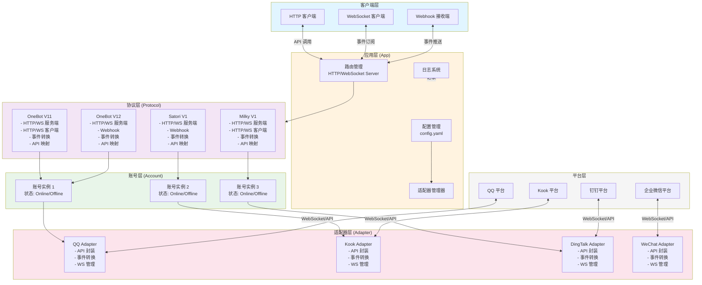
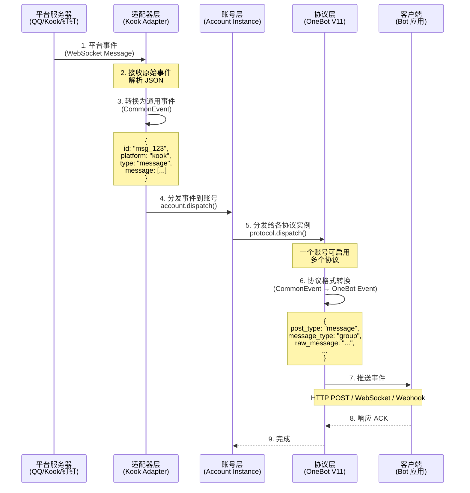
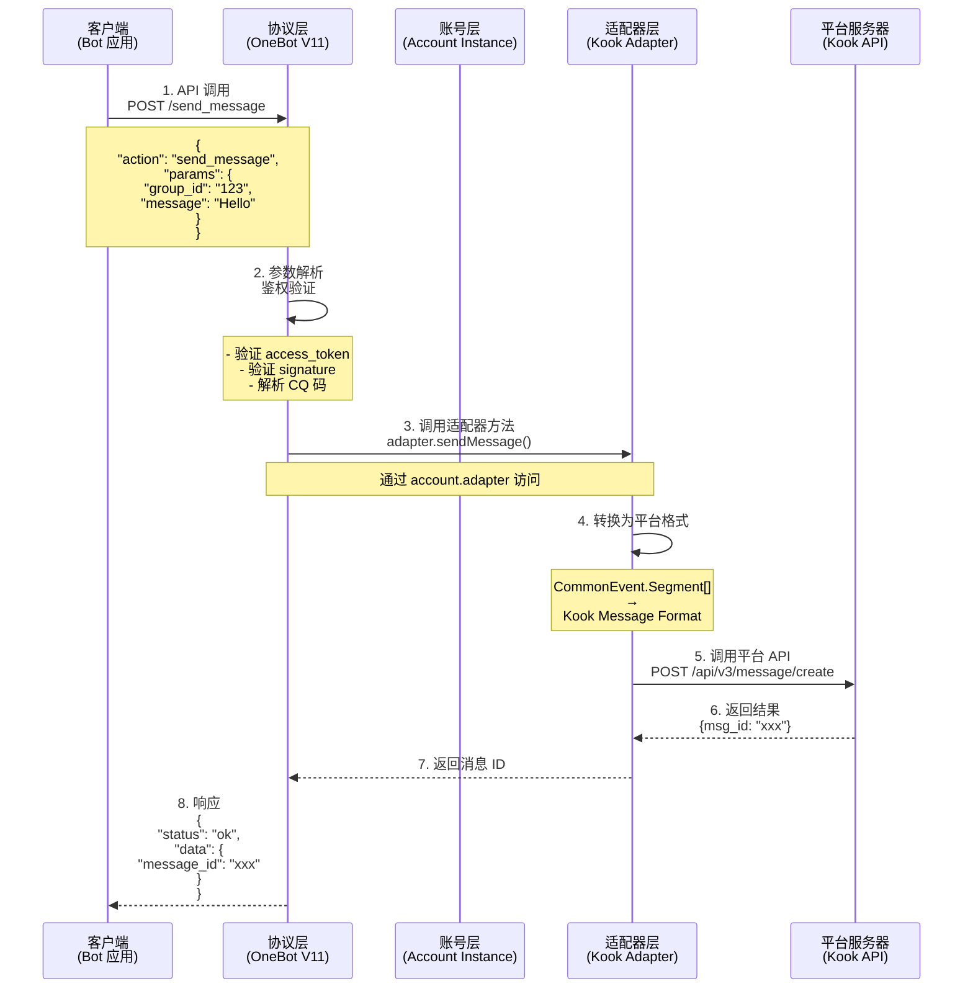
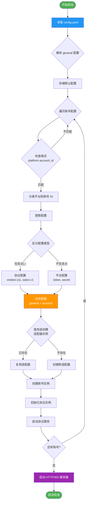
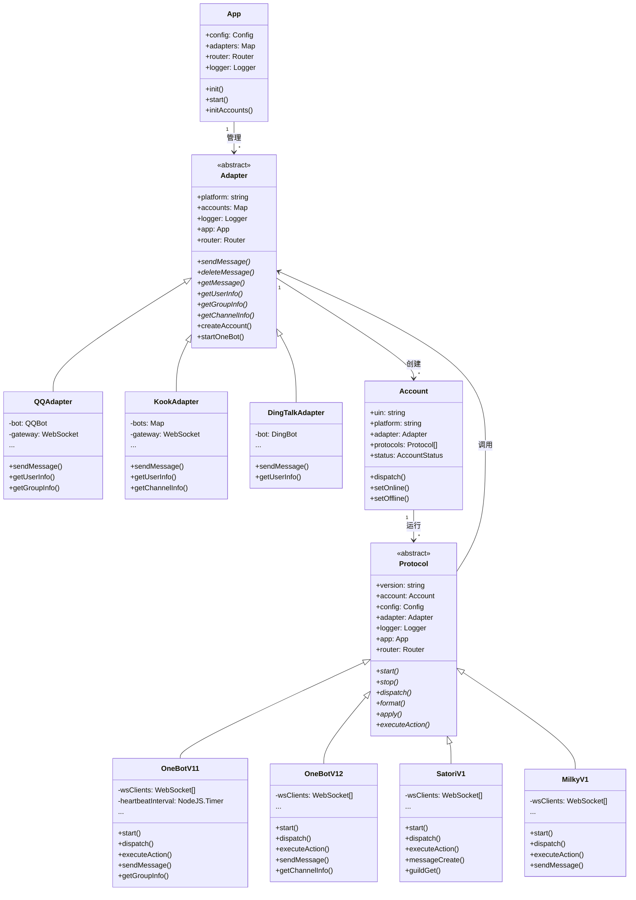
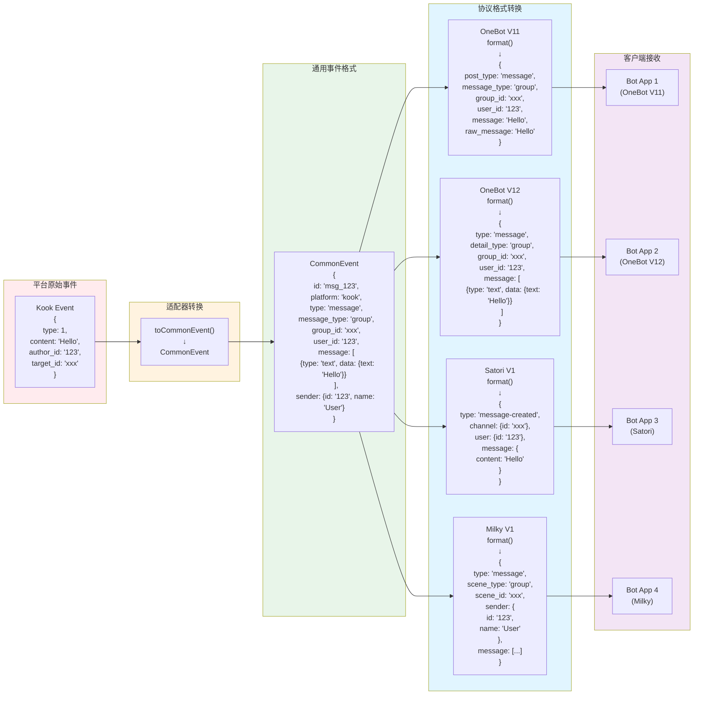
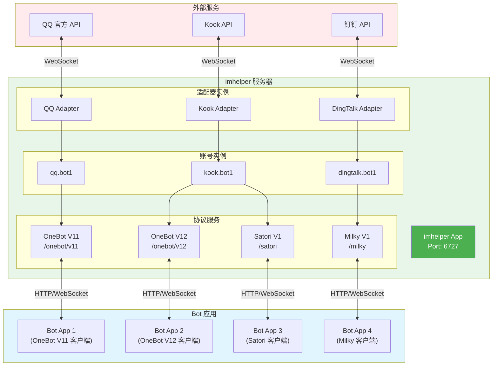

# imhelper 架构图

本文档包含 imhelper 项目的各种架构图，使用 Mermaid 语法编写。

## 导出图片的方法

### 方法 1: 使用 Mermaid Live Editor
1. 访问 https://mermaid.live/
2. 复制下面的 Mermaid 代码
3. 粘贴到编辑器
4. 点击右上角下载按钮导出为 PNG/SVG

### 方法 2: 使用 VS Code 插件
1. 安装 "Markdown Preview Mermaid Support" 插件
2. 预览本文档
3. 右键图表 → 导出图片

### 方法 3: 使用 Mermaid CLI
```bash
npm install -g @mermaid-js/mermaid-cli
mmdc -i architecture-diagrams.md -o output.png
```

---

## 1. 整体架构图



---

## 2. 接收消息流程图



---

## 3. 发送消息流程图



---

## 4. 配置加载流程图



---

## 5. 类继承关系图



---

## 6. 事件转换流程图



---

## 7. 协议通信方式对比图

```mermaid
graph TB
    subgraph OB["OneBot V11/V12"]
        direction TB
        OB_Server["服务端模式"]
        OB_HTTP["HTTP Server<br/>POST /api/action"]
        OB_WS["WebSocket Server<br/>WS /ws"]
        
        OB_Client["客户端模式"]
        OB_HTTP_Rev["HTTP Reverse<br/>POST to URL"]
        OB_WS_Rev["WebSocket Reverse<br/>Connect to URL"]
        
        OB_Auth["鉴权方式<br/>• access_token<br/>• secret (HMAC-SHA1)"]
        
        OB_Server --> OB_HTTP
        OB_Server --> OB_WS
        OB_Client --> OB_HTTP_Rev
        OB_Client --> OB_WS_Rev
    end
    
    subgraph SAT["Satori V1"]
        direction TB
        SAT_Server["服务端模式"]
        SAT_HTTP["HTTP Server<br/>POST /v1/method"]
        SAT_WS["WebSocket Server<br/>WS /v1/events"]
        
        SAT_Client["客户端模式"]
        SAT_Webhook["Webhook<br/>POST to URL"]
        
        SAT_Auth["鉴权方式<br/>• token (Bearer)"]
        
        SAT_Server --> SAT_HTTP
        SAT_Server --> SAT_WS
        SAT_Client --> SAT_Webhook
    end
    
    subgraph MLK["Milky V1"]
        direction TB
        MLK_Server["服务端模式"]
        MLK_HTTP["HTTP Server<br/>POST /path/:action"]
        MLK_WS["WebSocket Server<br/>WS /path"]
        
        MLK_Client["客户端模式"]
        MLK_HTTP_Rev["HTTP Reverse<br/>POST to URL"]
        MLK_WS_Rev["WebSocket Reverse<br/>Connect to URL"]
        
        MLK_Auth["鉴权方式<br/>• access_token<br/>• secret (HMAC-SHA1)"]
        
        MLK_Server --> MLK_HTTP
        MLK_Server --> MLK_WS
        MLK_Client --> MLK_HTTP_Rev
        MLK_Client --> MLK_WS_Rev
    end
    
    style OB fill:#e3f2fd
    style SAT fill:#f3e5f5
    style MLK fill:#fff3e0
    style OB_Auth fill:#ffcdd2
    style SAT_Auth fill:#ffcdd2
    style MLK_Auth fill:#ffcdd2
```



---

## 8. 目录结构图

```mermaid
graph TD
    Root["imhelper/"]
    
    Root --> Src["src/"]
    Root --> Config["config.yaml"]
    Root --> Package["package.json"]
    
    Src --> CoreFiles["核心文件"]
    Src --> Adapters["adapters/"]
    Src --> Protocols["protocols/"]
    Src --> Server["server/"]
    
    CoreFiles --> Account["account.ts<br/>账号管理"]
    CoreFiles --> Adapter["adapter.ts<br/>适配器基类"]
    CoreFiles --> Protocol["protocol.ts<br/>协议基类"]
    CoreFiles --> Types["common-types.ts<br/>类型定义"]
    CoreFiles --> Logger["logger.ts<br/>日志系统"]
    CoreFiles --> Router["router.ts<br/>路由管理"]
    
    Adapters --> QQ["qq/<br/>QQ 适配器"]
    Adapters --> Kook["kook/<br/>Kook 适配器"]
    Adapters --> DingTalk["dingtalk/<br/>钉钉适配器"]
    Adapters --> WeChat["wechat/<br/>企微适配器"]
    
    Kook --> KookIndex["index.ts"]
    Kook --> KookUtils["utils.ts"]
    Kook --> KookReadme["README.md"]
    
    Protocols --> OneBot["onebot/"]
    Protocols --> Satori["satori/"]
    Protocols --> Milky["milky/"]
    
    OneBot --> V11["v11.ts"]
    OneBot --> V12["v12.ts"]
    OneBot --> OBTypes["types.ts"]
    OneBot --> CQCode["cqcode.ts"]
    
    Satori --> SatV1["v1.ts"]
    Satori --> SatTypes["types.ts"]
    
    Milky --> MlkV1["v1.ts"]
    Milky --> MlkTypes["types.ts"]
    
    Server --> App["app.ts<br/>主应用"]
    Server --> Index["index.ts<br/>入口文件"]
    
    style Root fill:#4caf50,color:#fff
    style Src fill:#2196f3,color:#fff
    style CoreFiles fill:#ff9800,color:#fff
    style Adapters fill:#e91e63,color:#fff
    style Protocols fill:#9c27b0,color:#fff
    style Server fill:#00bcd4,color:#fff
```



---

## 9. 部署架构图



---

## 使用说明

1. **在线预览和导出**：复制任意图表的 Mermaid 代码到 https://mermaid.live/
2. **批量导出**：使用 Mermaid CLI 工具批量生成图片
3. **集成到文档**：Markdown 工具（如 Typora、VS Code）可直接渲染 Mermaid 图表
4. **自定义样式**：可以修改 `style` 语句调整颜色和样式

