# System Architecture

This document describes the overall architecture of the onebots system, including server and client components.

## Overall Architecture

```mermaid
graph TB
    subgraph Platforms["🌐 Platform Layer"]
        QQ["QQ Official Bot<br/>API"]
        WeChat["WeChat Official<br/>Platform API"]
        Kook["Kook Open Platform<br/>API"]
        Discord["Discord API"]
        DingTalk["DingTalk Open Platform<br/>API"]
    end

    subgraph Server["🖥️ onebots Server"]
        subgraph AppLayer["Application Layer"]
            BaseApp["BaseApp<br/>- Config Management<br/>- Logging System<br/>- HTTP/WS Server<br/>- Route Management<br/>- Lifecycle Management"]
            Config["Config Management<br/>config.yaml"]
            Router["Route Management<br/>Koa Router"]
        end

        subgraph AdapterLayer["Adapter Layer"]
            QQAdapter["QQ Adapter<br/>@onebots/adapter-qq<br/>- Connect to QQ Platform<br/>- Event Extraction<br/>- Action Execution"]
            WeChatAdapter["WeChat Adapter<br/>@onebots/adapter-wechat<br/>- Connect to WeChat Platform<br/>- Event Extraction<br/>- Action Execution"]
            KookAdapter["Kook Adapter<br/>@onebots/adapter-kook<br/>- Connect to Kook Platform<br/>- Event Extraction<br/>- Action Execution"]
            DiscordAdapter["Discord Adapter<br/>@onebots/adapter-discord<br/>- Connect to Discord Platform<br/>- Event Extraction<br/>- Action Execution"]
        end

        subgraph AccountLayer["Account Layer"]
            Account1["Account Instance<br/>qq.bot1<br/>- Status Management<br/>- Protocol Binding"]
            Account2["Account Instance<br/>wechat.mp1<br/>- Status Management<br/>- Protocol Binding"]
            Account3["Account Instance<br/>kook.bot1<br/>- Status Management<br/>- Protocol Binding"]
        end

        subgraph ProtocolLayer["Protocol Layer"]
            V11Protocol["OneBot V11 Protocol<br/>@onebots/protocol-onebot-v11<br/>- HTTP API<br/>- WebSocket API<br/>- Event Conversion"]
            V12Protocol["OneBot V12 Protocol<br/>@onebots/protocol-onebot-v12<br/>- HTTP API<br/>- WebSocket API<br/>- Event Conversion"]
            SatoriProtocol["Satori Protocol<br/>@onebots/protocol-satori-v1<br/>- HTTP API<br/>- WebSocket API<br/>- Event Conversion"]
        end
    end

    subgraph Client["💻 Client SDK (imhelper)"]
        ImHelper["ImHelper<br/>- Unified Interface<br/>- Message Conversion<br/>- Event Handling"]
        Receivers["Receivers<br/>- WebSocket<br/>- Webhook<br/>- SSE"]
        Adapters["Protocol Adapters<br/>- OneBot V11<br/>- OneBot V12<br/>- Satori<br/>- Milky"]
    end

    subgraph Frameworks["🤖 Robot Frameworks"]
        Koishi["Koishi"]
        NoneBot["NoneBot"]
        Yunzai["Yunzai"]
    end

    Platforms --> AdapterLayer
    AdapterLayer --> AccountLayer
    AccountLayer --> ProtocolLayer
    ProtocolLayer --> Client
    Client --> Frameworks
```

## Component Description

### Server Components

#### 1. Application Layer
- **BaseApp**: Core application class, manages HTTP/WebSocket servers, routing, middleware
- **Config Management**: YAML configuration file parsing and management
- **Route Management**: Koa router for handling HTTP requests

#### 2. Adapter Layer
- **Platform Adapters**: Connect to different IM platforms (QQ, WeChat, Kook, etc.)
- **Event Extraction**: Convert platform-specific events to unified format
- **Action Execution**: Execute actions like sending messages, managing groups

#### 3. Account Layer
- **Account Instances**: Manage individual bot accounts
- **Status Management**: Track account online/offline status
- **Protocol Binding**: Bind accounts to specific protocols

#### 4. Protocol Layer
- **Protocol Implementations**: Implement standard protocols (OneBot V11/V12, Satori, etc.)
- **API Endpoints**: Provide HTTP and WebSocket APIs
- **Event Conversion**: Convert unified events to protocol-specific formats

### Client Components

#### 1. ImHelper
- **Unified Interface**: Provides a unified API regardless of protocol
- **Message Conversion**: Converts protocol-specific messages to unified format
- **Event Handling**: Handles events from different protocols

#### 2. Receivers
- **WebSocket Receiver**: Real-time event reception via WebSocket
- **Webhook Receiver**: Event reception via HTTP webhook
- **SSE Receiver**: Event reception via Server-Sent Events

#### 3. Protocol Adapters
- **OneBot V11 Adapter**: Client SDK for OneBot V11 protocol
- **OneBot V12 Adapter**: Client SDK for OneBot V12 protocol
- **Satori Adapter**: Client SDK for Satori protocol
- **Milky Adapter**: Client SDK for Milky protocol

## Data Flow

### Server-Side Flow

1. **Platform Event** → Adapter receives event from platform
2. **Event Conversion** → Adapter converts to unified format
3. **Account Processing** → Account instance processes event
4. **Protocol Conversion** → Protocol layer converts to protocol-specific format
5. **API Response** → Returns to client via HTTP/WebSocket

### Client-Side Flow

1. **Connect** → Client connects to server via WebSocket/Webhook/SSE
2. **Receive Event** → Receiver receives protocol-specific event
3. **Protocol Adapter** → Protocol adapter converts to unified format
4. **ImHelper** → ImHelper provides unified interface
5. **Application** → Application handles events and sends actions

## Design Principles

1. **Separation of Concerns**: Clear separation between adapters, protocols, and applications
2. **Unified Interface**: Consistent API across different platforms and protocols
3. **Extensibility**: Easy to add new platforms and protocols
4. **Type Safety**: Full TypeScript support for better development experience
5. **Modularity**: Each component is independent and can be used separately

