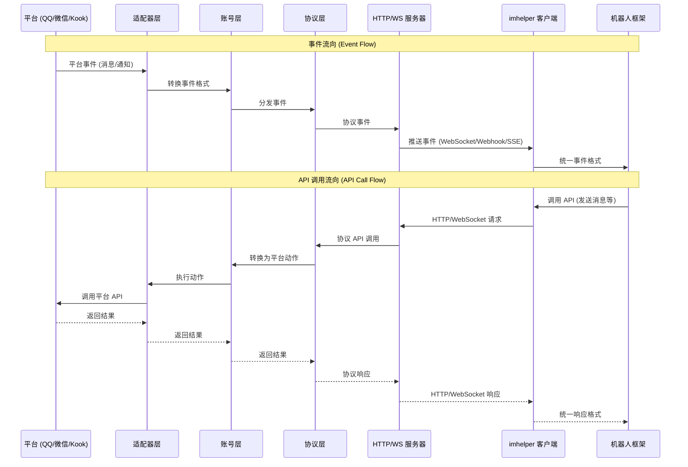

# onebots 系统架构

本文档描述了 onebots 系统的整体架构，包括服务端和客户端组件。

## 整体架构图

> 建议放大查看

```mermaid
graph TB
    subgraph Platforms["🌐 平台层 (Platform Layer)"]
        QQ["QQ 官方机器人<br/>API"]
        WeChat["微信公众平台<br/>API"]
        Kook["Kook 开放平台<br/>API"]
        Discord["Discord API"]
        DingTalk["钉钉开放平台<br/>API"]
    end

    subgraph Server["🖥️ onebots 服务端 (Server)"]
        subgraph AppLayer["应用层 (App Layer)"]
            BaseApp["BaseApp<br/>- 配置管理<br/>- 日志系统<br/>- HTTP/WS 服务器<br/>- 路由管理<br/>- 生命周期管理"]
            Config["配置管理<br/>config.yaml"]
            Router["路由管理<br/>Koa Router"]
        end

        subgraph AdapterLayer["适配器层 (Adapter Layer)"]
            QQAdapter["QQ Adapter<br/>@onebots/adapter-qq<br/>- 连接 QQ 平台<br/>- 事件提取<br/>- 动作执行"]
            WeChatAdapter["WeChat Adapter<br/>@onebots/adapter-wechat<br/>- 连接微信平台<br/>- 事件提取<br/>- 动作执行"]
            KookAdapter["Kook Adapter<br/>@onebots/adapter-kook<br/>- 连接 Kook 平台<br/>- 事件提取<br/>- 动作执行"]
            DiscordAdapter["Discord Adapter<br/>@onebots/adapter-discord<br/>- 连接 Discord 平台<br/>- 事件提取<br/>- 动作执行"]
        end

        subgraph AccountLayer["账号层 (Account Layer)"]
            Account1["Account Instance<br/>qq.bot1<br/>- 状态管理<br/>- 协议绑定"]
            Account2["Account Instance<br/>wechat.mp1<br/>- 状态管理<br/>- 协议绑定"]
            Account3["Account Instance<br/>kook.bot1<br/>- 状态管理<br/>- 协议绑定"]
        end

        subgraph ProtocolLayer["协议层 (Protocol Layer)"]
            OB11["OneBot V11 Protocol<br/>@onebots/protocol-onebot-v11<br/>- HTTP API Server<br/>- WebSocket Server<br/>- 事件转换<br/>- API 映射"]
            OB12["OneBot V12 Protocol<br/>@onebots/protocol-onebot-v12<br/>- HTTP API Server<br/>- WebSocket Server<br/>- Webhook<br/>- 事件转换<br/>- API 映射"]
            Satori["Satori V1 Protocol<br/>@onebots/protocol-satori-v1<br/>- HTTP API Server<br/>- WebSocket Server<br/>- Webhook<br/>- 事件转换<br/>- API 映射"]
            Milky["Milky V1 Protocol<br/>@onebots/protocol-milky-v1<br/>- HTTP API Server<br/>- WebSocket Server<br/>- 事件转换<br/>- API 映射"]
        end

        subgraph ServerAPI["服务端 API"]
            HTTPServer["HTTP Server<br/>:6727"]
            WSServer["WebSocket Server"]
        end
    end

    subgraph Client["💻 imhelper 客户端 (Client SDK)"]
        subgraph ClientCore["客户端核心 (imhelper)"]
            ImHelper["ImHelper<br/>统一接口<br/>- 消息发送<br/>- 事件监听<br/>- 账号管理"]
        end

        subgraph ClientAdapters["客户端适配器"]
            OB11Client["OneBot V11 Adapter<br/>@imhelper/onebot-v11<br/>- HTTP Client<br/>- WebSocket Receiver<br/>- Webhook Receiver<br/>- SSE Receiver"]
            OB12Client["OneBot V12 Adapter<br/>@imhelper/onebot-v12<br/>- HTTP Client<br/>- WebSocket Receiver<br/>- Webhook Receiver<br/>- SSE Receiver"]
            SatoriClient["Satori V1 Adapter<br/>@imhelper/satori-v1<br/>- HTTP Client<br/>- WebSocket Receiver<br/>- Webhook Receiver<br/>- SSE Receiver"]
            MilkyClient["Milky V1 Adapter<br/>@imhelper/milky-v1<br/>- HTTP Client<br/>- WebSocket Receiver<br/>- Webhook Receiver<br/>- SSE Receiver"]
        end

        subgraph Receivers["接收器 (Receivers)"]
            WSReceiver["WebSocket Receiver<br/>- 实时事件接收<br/>- 自动重连"]
            WSSReceiver["WSS Receiver<br/>- 安全 WebSocket<br/>- TLS 加密"]
            WebhookReceiver["Webhook Receiver<br/>- HTTP 服务器<br/>- 事件推送接收"]
            SSEReceiver["SSE Receiver<br/>- Server-Sent Events<br/>- 长连接"]
        end
    end

    subgraph Frameworks["🤖 机器人框架层 (Framework Layer)"]
        Koishi["Koishi<br/>跨平台机器人框架"]
        NoneBot["NoneBot2<br/>Python 异步框架"]
        Yunzai["Yunzai-Bot<br/>QQ 机器人框架"]
        CustomApp["自定义应用<br/>使用 imhelper SDK"]
    end

    %% 平台到适配器
    QQ --> QQAdapter
    WeChat --> WeChatAdapter
    Kook --> KookAdapter
    Discord --> DiscordAdapter

    %% 应用层到适配器
    BaseApp --> Config
    BaseApp --> Router
    BaseApp --> QQAdapter
    BaseApp --> WeChatAdapter
    BaseApp --> KookAdapter
    BaseApp --> DiscordAdapter

    %% 适配器到账号
    QQAdapter --> Account1
    WeChatAdapter --> Account2
    KookAdapter --> Account3

    %% 账号到协议
    Account1 --> OB11
    Account1 --> OB12
    Account1 --> Satori
    Account2 --> OB11
    Account2 --> OB12
    Account3 --> OB11
    Account3 --> Satori

    %% 协议到服务器
    OB11 --> HTTPServer
    OB11 --> WSServer
    OB12 --> HTTPServer
    OB12 --> WSServer
    Satori --> HTTPServer
    Satori --> WSServer
    Milky --> HTTPServer
    Milky --> WSServer

    %% 客户端适配器
    ImHelper --> OB11Client
    ImHelper --> OB12Client
    ImHelper --> SatoriClient
    ImHelper --> MilkyClient

    %% 客户端适配器到接收器
    OB11Client --> WSReceiver
    OB11Client --> WSSReceiver
    OB11Client --> WebhookReceiver
    OB11Client --> SSEReceiver
    OB12Client --> WSReceiver
    OB12Client --> WSSReceiver
    OB12Client --> WebhookReceiver
    OB12Client --> SSEReceiver

    %% 服务器到客户端
    HTTPServer -.HTTP API.-> OB11Client
    HTTPServer -.HTTP API.-> OB12Client
    HTTPServer -.HTTP API.-> SatoriClient
    WSServer -.WebSocket.-> WSReceiver
    WSServer -.WebSocket.-> WSSReceiver
    HTTPServer -.Webhook.-> WebhookReceiver
    HTTPServer -.SSE.-> SSEReceiver

    %% 客户端到框架
    ImHelper --> CustomApp
    OB11Client --> Koishi
    OB12Client --> Koishi
    OB11Client --> NoneBot
    OB12Client --> NoneBot
    OB11Client --> Yunzai

    %% 样式
    style BaseApp fill:#4CAF50,stroke:#333,stroke-width:3px,color:#fff
    style QQAdapter fill:#2196F3,stroke:#333,stroke-width:2px,color:#fff
    style WeChatAdapter fill:#2196F3,stroke:#333,stroke-width:2px,color:#fff
    style KookAdapter fill:#2196F3,stroke:#333,stroke-width:2px,color:#fff
    style DiscordAdapter fill:#2196F3,stroke:#333,stroke-width:2px,color:#fff
    style OB11 fill:#FF9800,stroke:#333,stroke-width:2px,color:#fff
    style OB12 fill:#FF9800,stroke:#333,stroke-width:2px,color:#fff
    style Satori fill:#FF9800,stroke:#333,stroke-width:2px,color:#fff
    style Milky fill:#FF9800,stroke:#333,stroke-width:2px,color:#fff
    style ImHelper fill:#9C27B0,stroke:#333,stroke-width:3px,color:#fff
    style OB11Client fill:#E91E63,stroke:#333,stroke-width:2px,color:#fff
    style OB12Client fill:#E91E63,stroke:#333,stroke-width:2px,color:#fff
    style SatoriClient fill:#E91E63,stroke:#333,stroke-width:2px,color:#fff
    style MilkyClient fill:#E91E63,stroke:#333,stroke-width:2px,color:#fff
```

## 数据流向图

## 组件说明

### 服务端组件

#### 1. 应用层 (App Layer)
- **BaseApp**: 核心应用基类，提供配置管理、日志系统、HTTP/WebSocket 服务器、路由管理等基础功能
- **配置管理**: 基于 YAML 的配置文件，支持全局配置、账号配置、协议配置
- **路由管理**: 基于 Koa 的路由系统，动态注册协议路由

#### 2. 适配器层 (Adapter Layer)
- **QQ Adapter**: 连接 QQ 官方机器人平台
- **WeChat Adapter**: 连接微信公众平台
- **Kook Adapter**: 连接 Kook 开放平台
- **Discord Adapter**: 连接 Discord API
- 每个适配器负责：
  - 连接平台 API
  - 提取平台事件并转换为统一格式
  - 执行平台动作（发送消息、管理群组等）

#### 3. 账号层 (Account Layer)
- 管理每个平台账号的实例
- 维护账号状态（在线/离线）
- 绑定协议实例
- 处理账号级别的事件分发

#### 4. 协议层 (Protocol Layer)
- **OneBot V11**: 提供 OneBot V11 标准协议接口
- **OneBot V12**: 提供 OneBot V12 标准协议接口
- **Satori V1**: 提供 Satori 协议接口
- **Milky V1**: 提供 Milky 协议接口
- 每个协议负责：
  - 实现协议标准的 HTTP/WebSocket 接口
  - 转换平台事件为协议事件格式
  - 转换协议 API 调用为平台动作

### 客户端组件

#### 1. imhelper 核心
- **ImHelper**: 统一的客户端接口，提供：
  - 消息发送 API
  - 事件监听
  - 账号管理
  - 跨协议的统一抽象

#### 2. 客户端适配器
- **OneBot V11 Adapter**: OneBot V11 协议的客户端实现
- **OneBot V12 Adapter**: OneBot V12 协议的客户端实现
- **Satori V1 Adapter**: Satori 协议的客户端实现
- **Milky V1 Adapter**: Milky 协议的客户端实现
- 每个适配器包含：
  - HTTP 客户端（用于 API 调用）
  - 事件接收器（WebSocket/Webhook/SSE）

#### 3. 接收器 (Receivers)
- **WebSocket Receiver**: 实时事件接收，支持自动重连
- **WSS Receiver**: 安全 WebSocket，TLS 加密
- **Webhook Receiver**: HTTP 服务器，接收服务端推送的事件
- **SSE Receiver**: Server-Sent Events，长连接事件接收

## 通信方式

### 服务端提供的通信方式

1. **HTTP API**: RESTful API，用于调用机器人功能
2. **WebSocket**: 双向通信，支持实时事件推送和 API 调用
3. **Webhook**: 服务端主动推送事件到客户端
4. **SSE**: Server-Sent Events，单向事件流

### 客户端支持的接收方式

1. **WebSocket**: 连接到服务端 WebSocket，实时接收事件
2. **WSS**: 安全 WebSocket 连接
3. **Webhook**: 启动 HTTP 服务器，接收服务端推送
4. **SSE**: 通过 Server-Sent Events 接收事件流

## 扩展性

### 添加新平台

1. 创建新的适配器包（如 `adapter-telegram`）
2. 实现 `Adapter` 基类
3. 注册到 `AdapterRegistry`
4. 配置账号信息

### 添加新协议

1. 创建新的协议包（如 `protocol-telegram-bot-api`）
2. 实现 `Protocol` 基类
3. 注册到 `ProtocolRegistry`
4. 配置协议选项

### 自定义客户端

1. 使用 `imhelper` 核心
2. 选择或创建协议适配器
3. 选择接收方式（WebSocket/Webhook/SSE）
4. 实现业务逻辑

## 相关链接

- [快速开始](/guide/start)
- [客户端SDK使用指南](/guide/client-sdk)
- [适配器开发指南](/guide/adapter)
- [配置说明](/config/global)

